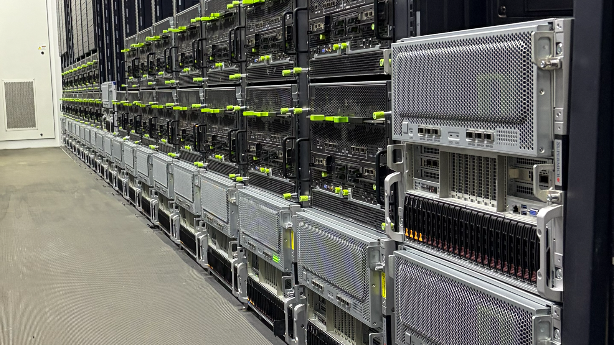
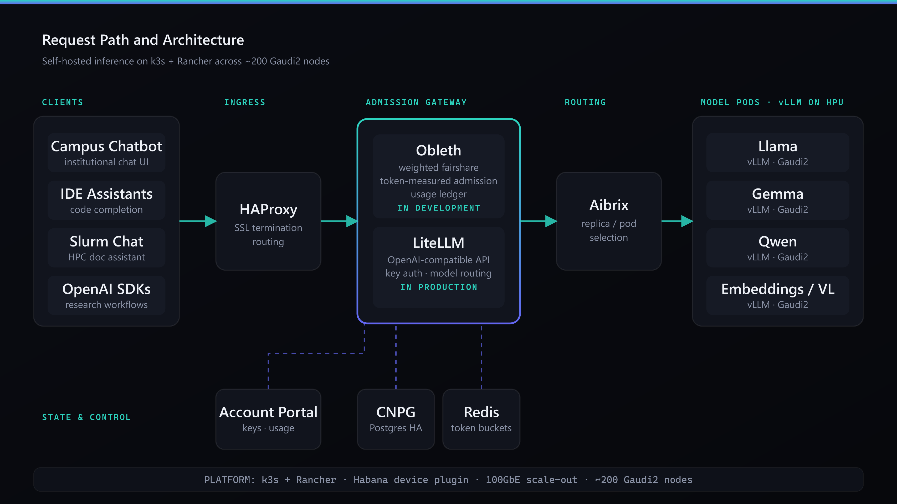
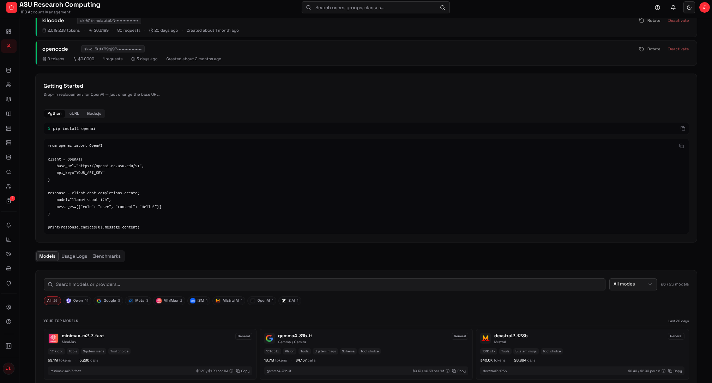
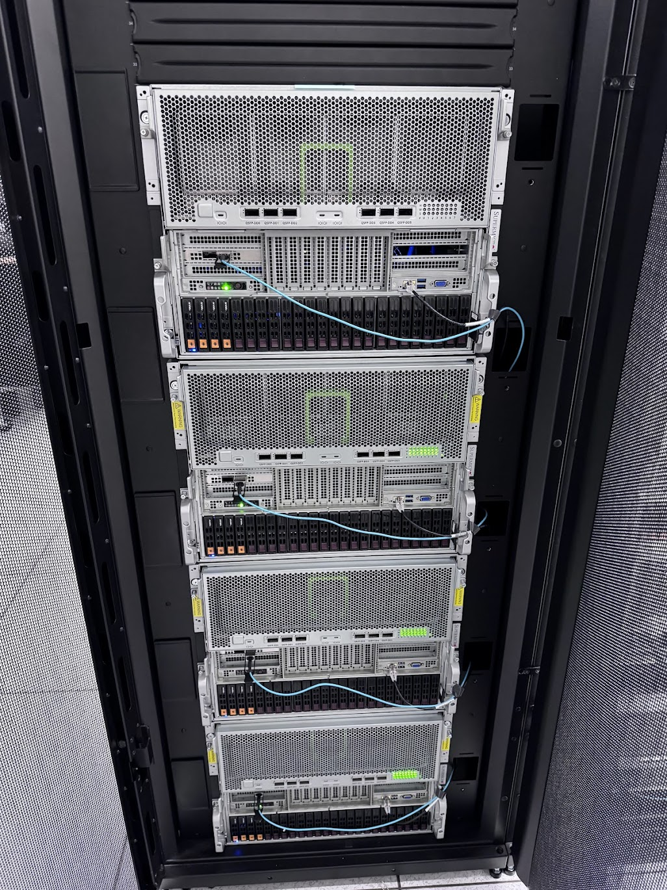
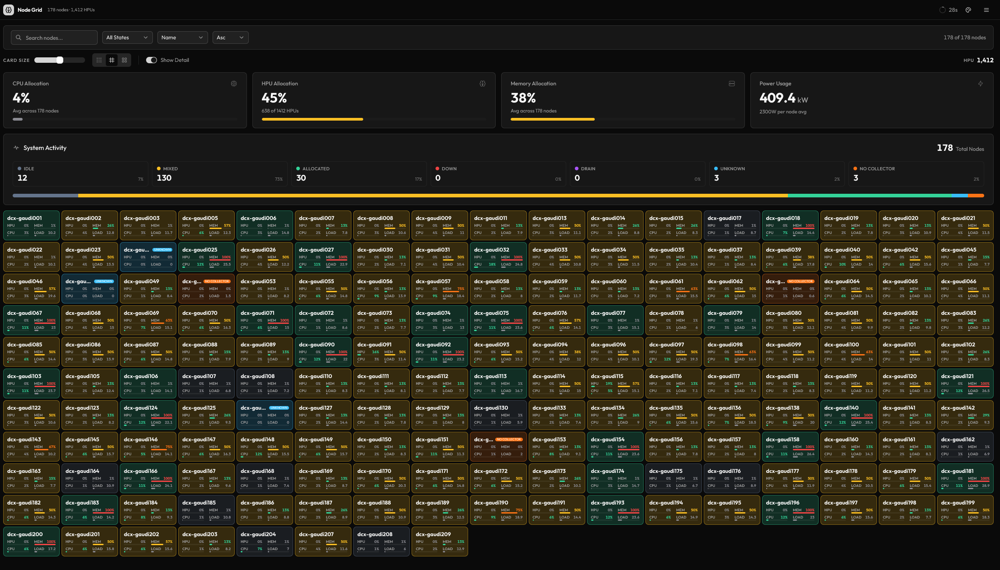
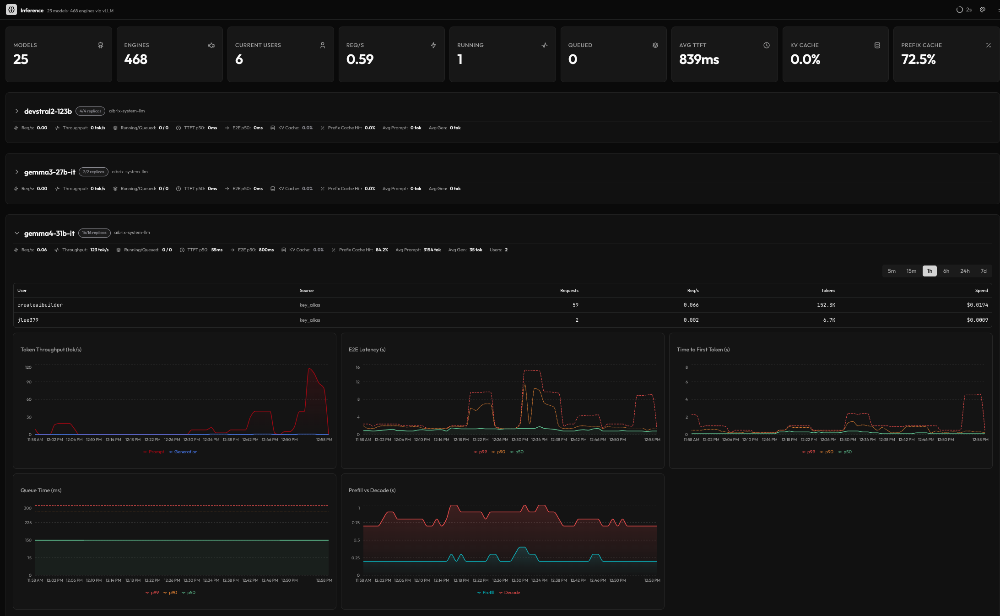
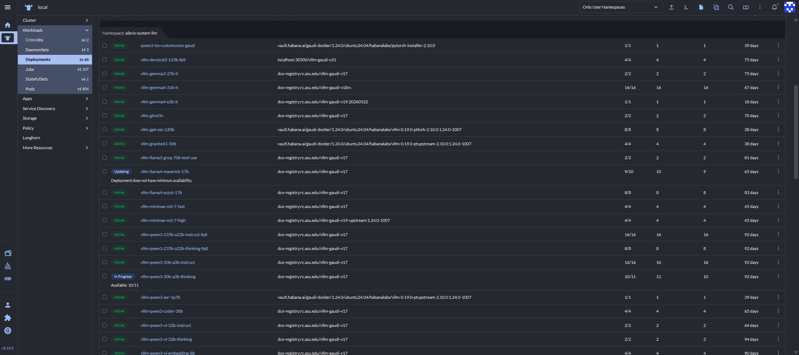
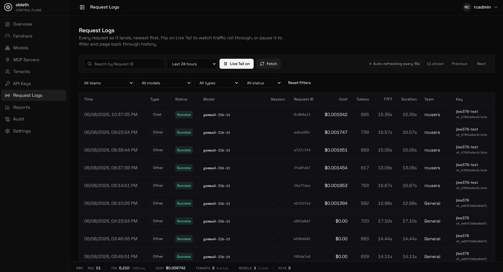
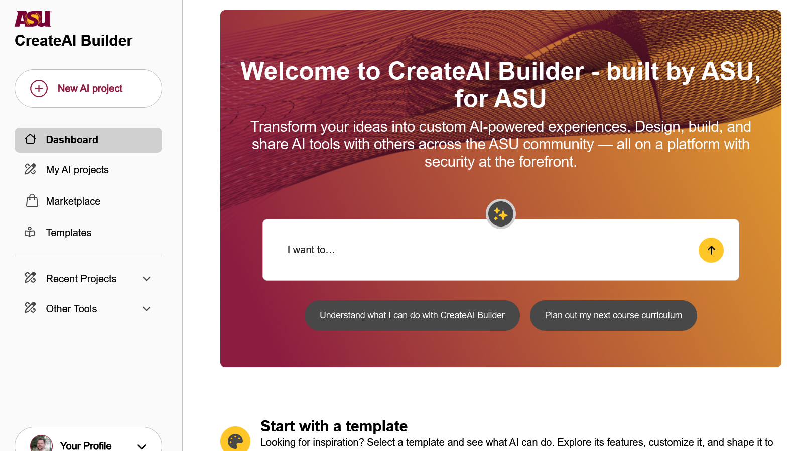

<!-- _class: lead -->
<!-- _paginate: false -->
<!-- _header: '' -->

# Running Persistent LLMs for an Entire Campus

A technical walkthrough of the stack we run for always-on, self-hosted
inference: **Kubernetes (k3s + Rancher), vLLM, LiteLLM, CNPG, HAProxy**, and an
in-house account system, plus where that stack breaks down and what we are
building to replace it.

**Johnathan Lee** · Arizona State University · Sr. HPC System Architect

---

## Why Self-Host Inference

The model is the easy part. The engineering problem is operating it as a
persistent, multi-tenant service with predictable capacity and accounting.

- **Cost structure:** Capacity is a fixed capital asset, not a per-token operating bill that scales with usage.
- **Data locality:** Research and administrative prompts stay inside institutional infrastructure for compliance and IRB constraints.
- **Always-on endpoints:** Models stay resident behind a stable API rather than being loaded per batch job.
- **Integration surface:** A single OpenAI-compatible API lets internal tools consume inference without per-call budgeting.

> The rest of this talk is about the stack required to make that dependable, and the parts that are still hard.

---

## Production Stack at a Glance

| Layer | What We Run |
| --- | --- |
| **Orchestration** | Kubernetes via **k3s + Rancher** across ~**200 Gaudi2 nodes** |
| **Node Images** | **Warewulf**-provisioned, so a node rebuilds to a known image |
| **Storage** | **Longhorn** PVCs on each node's local **7 TB NVMe** |
| **Inference** | vLLM (Habana-optimized) model pods, one deployment per architecture |
| **API Gateway** | **LiteLLM**: OpenAI-compatible surface, key auth, model routing |
| **Ingress** | **HAProxy**: SSL termination and routing for chat and IDE traffic |
| **State / Metadata** | **CloudNativePG (CNPG)**: Postgres operator for HA databases, backed up to **S3** |
| **Accounts & Keys** | In-house provisioning portal for self-service keys and usage |

> Warewulf images make nodes disposable; Longhorn keeps persistent data on the NVMe that is already in each box, so we add no external storage tier.

---

<!-- _class: image -->

## Request Path and Architecture

*HAProxy ingress &rarr; LiteLLM / Obleth admission &rarr; vLLM + Aibrix model pods on k3s + Rancher.*

---

## Account Management and Identity

We run our own provisioning service rather than giving access directly to LiteLLM, so
onboarding does not require operator intervention.

- **Account provisioning:** Campus users self-register and map to an institutional identity.
- **API key issuance:** Keys are minted, scoped, and rotated through the portal.
- **Usage visibility:** Each user sees their own token consumption and request history.
- **Model inventory:** Active endpoints, context limits, and hardware requirements are surfaced per account.

> Without this layer, access is a handful of shared admin keys. With it, every key maps to a named user, so usage and limits are per person.

---

<!-- _class: image -->

## Self-Service Account Portal

*Users provision their own keys and watch live token usage and request history.*

---

## Why Our HPC Playbook Did Not Fit

We are an HPC shop. This hardware would normally run Slurm. LLM serving breaks
that model on every axis, which is the reason the rest of this stack exists.

| Batch HPC (Slurm) | Persistent LLM Serving |
| --- | --- |
| **Jobs are finite:** queue, run, release the nodes. | **Service never exits:** model pods stay resident 24/7. |
| **User reserves nodes** up front for a wall-time. | **Thousands share** one endpoint with no reservation. |
| **Scheduler owns fairness** between queued jobs. | **No scheduler in the path:** a live request needs admission control instead. |
| **Success = job completes.** | **Success = low latency** under constant concurrent load. |

> Slurm still fits finite research runs. A 24/7 multi-tenant endpoint needs Kubernetes, a gateway, and per-user accounting instead of a batch queue, which is what the rest of this stack provides.

---

## The Hardware Reality: Gaudi2

Running non-NVIDIA accelerators gave us capacity, but the supporting 
software lagged well behind the hardware.

- **Ecosystem gaps:** For a long time little worked unmodified. Frameworks, serving engines, and Kubernetes operators assumed CUDA.
- **Manual enablement:** The Habana device plugin, driver and firmware parity, and vLLM-on-HPU all had to be stood up and kept in lockstep across the fleet.
- **Recent viability:** Only recently has the surrounding software matured enough to treat Gaudi2 as a dependable serving target.
- **Tradeoff:** Large aggregate HBM per node and native 100GbE scale-out, once the stack is in place.

> We were handed Gaudi2 and made it work. The stack above it no longer depends on the accelerator, though a team starting on NVIDIA today has a far easier first day.

---

## Operating the Fleet: Real-Time Observability

Running ~200 always-on nodes means the question is never "did the job finish."
It is "what is the fleet doing right now." We watch three layers live.

- **Node grid:** per-node HPU, CPU, and memory allocation, power draw, and state (idle / mixed / allocated / down) across the entire fleet at a glance.
- **Per-model inference telemetry:** requests/s, time-to-first-token, KV and prefix cache hit rate, throughput, and spend, broken out per model and per user.
- **Rancher control plane:** ~60 vLLM deployments managed declaratively, with rollout state, replica health, and image versions visible in one place.
- **Capacity decisions:** these views drive what we scale, drain, and reschedule rather than guessing from job logs.

> A batch job ends with an exit code. A persistent service has no such signal, so these dashboards are how we see that it is healthy.

---

<!-- _class: image -->

## Live Node Status Across the Fleet

*178 nodes and 1,412 HPUs: allocation, power draw, and per-node health updating in real time.*

---

<!-- _class: image -->

## Per-Model Inference Telemetry

*Live per-model view: requests/s, TTFT, cache hit rate, throughput, and spend down to the individual user.*

---

<!-- _class: image -->

## Rancher: Declarative Control Plane

*Rancher manages the vLLM fleet declaratively: rollout state, replica health, and image versions per model.*

---

## LiteLLM: What It Does and Where It Stops

LiteLLM works well as a provider-abstraction proxy: one OpenAI-compatible
surface, multi-backend routing, and per-key rate limits. On a dedicated,
frequently saturated cluster, its rate-limiting model causes problems.

- **Per-key limits are not contention-aware.** A key capped at 1000 RPM is rejected at 201 RPM even when the rest of the cluster is idle. Unused capacity is not redistributed.
- **It counts requests, not tokens.** A thousand 1-token requests and one 100k-token request cost the same in RPM, but not on the GPU.
- **Saturation produces hard rejection.** Under load it returns 429s, so important traffic competes by retrying faster rather than by configured priority.
- **No live priority.** Adjusting a tenant's weight requires a config reload.

> What we needed was admission control measured in GPU time, not request count.

---

## Obleth: Fairshare Admission for Self-Hosted Inference

Obleth is a fairshare-first gateway we have running in development, targeted at
self-hosted inference rather than cloud-provider routing. It sits between HAProxy
and the vLLM/Aibrix backends and owns the admission layer LiteLLM omits.

- **Weighted fairshare under load:** when the pool is full, the tenant most behind on fair share gets the next slot instead of whoever arrived first. The algorithm is starvation-free.
- **Token-measured admission (TPM):** per-tenant token buckets in Redis with Lua-atomic updates, so fairness tracks token cost rather than request rate.
- **Token-accurate accounting:** tokens are reserved at admission and reconciled at stream end, and every request lands in a usage ledger.
- **Live priority:** a tenant's weight can be changed from the dashboard and every gateway pod honors it without a restart.

> Cache hits return before fairshare runs. When the pool is full, work queues by weighted share rather than failing outright.

---

<!-- _class: image -->

## Obleth Control Plane

*Live fairshare weights, in-flight slots, and per-tenant usage from one control plane.*

---

## LiteLLM vs. Obleth

| Capability | LiteLLM | Obleth |
| --- | --- | --- |
| Multi-tenant API keys | yes | yes |
| Rate limiting | per-key RPM | token-measured TPM |
| Weighted fairshare under saturation | no | yes |
| Queue instead of immediate 429 | beta, priority-only | yes, fairshare |
| Live priority change (no restart) | no | yes |
| Burst above share when idle | no, static cap | yes, reclaimed on contention |

- **OpenAI-compatible:** existing SDKs work by changing base URL and key. Chat, embeddings, images, audio, and MCP share one surface.
- **Self-hosted:** a single Rust binary, source-available under Elastic License 2.0, with no license fee. Limits are hardware and quota.
- **Composes with Aibrix:** Obleth decides who sends and at what priority; Aibrix selects the replica. The two do not duplicate routing logic.

---

## Operating as a Campus Backend Provider

The platform has shifted from a service we run to infrastructure other campus
teams build on top of.

- **Campus chatbot backend:** our endpoints serve the institutional chat assistant using local models.
- **Tooling on fixed-cost capacity:** because inference is a fixed local asset, internal tools call it freely instead of metering each request.
- **Slurm Chat and similar tools:** natural-language assistants for HPC documentation and cluster configuration run directly against our models.
- **Integrated assistants:** coding helpers and research workflows use the same OpenAI-compatible API.

> Removing per-call cost changes how teams use inference: they integrate it into normal workflows rather than rationing it per request.

---

<!-- _class: image -->

## Tools Built on the Platform

*The institutional chatbot and Slurm Chat both run against local model endpoints.*

---

## Roadmap

- **Promote Obleth to production** in front of the campus chatbot and research tenants.
- **Grow campus-wide adoption** by onboarding more departments, courses, and administrative teams onto the shared endpoint.
- **Expand the use-case catalog** with new agentic, multimodal, and research-specific workloads as demand surfaces.
- **Scale to larger, multi-node models** using the 100GbE fabric to serve frontier-size models that exceed a single node.
- **Deepen integrations** with agentic and lab-specific workflows on the shared endpoint.
- **Continue Gaudi2 enablement** as model recipes and HPU software support improve.

---

<!-- _class: lead -->
<!-- _header: '' -->

# Questions?

### Running Persistent LLMs for an Entire Campus

Stack · k3s + Rancher · vLLM · LiteLLM · CNPG · HAProxy · Obleth

**github.com/thediymaker**
